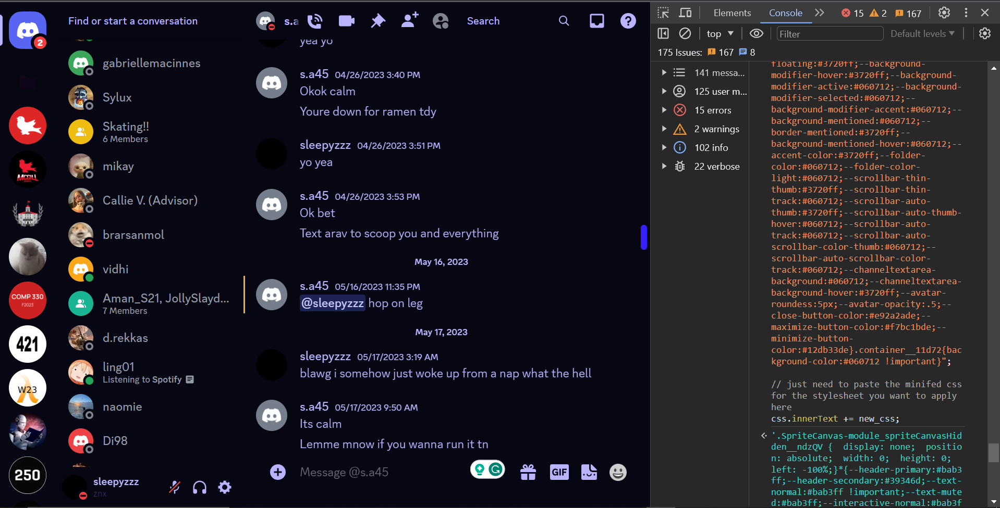

# about
repo for discord custom css stylesheets 

## usage **better discord**
this is the recommeneded way to use custom css on the discord desktop client i.e app   
1. download [better_discord](https://betterdiscord.app/)  
2. install better discord locally  
3. launch discord and naviage to `settings > custom css`  
4. paste the custom css e.x `./lunar.css` into the textarea  
5. should apply the changes after saving immedietly  

### usage discord.com web **using website**  
1. open [the discord website](https://discord.com/channels/@me)  
2. press `ctrl + shift + i` *this opens up the inspect element/dev panel  
3. press the console option  
4. copy the inject_css.js file and edit the value of new_css to be a string containing the minified css for whatever css you want to apply default value of new_css is set to minified lunar.css file  
5. copy paste the js code into the webrowser console and press enter
6. please note discord console logs some warnings telling you to not copy paste anything into the console. this is to avoid leaking your user token by someone with malicious js. feel free to check for yourself but the js here does not do much at all.

console_image

#### stylesheet list
| name      | type  | works |
| --------- | ----- | ----- |
| lunar.css | dark  | y     |
| nene.css  | light | y     |